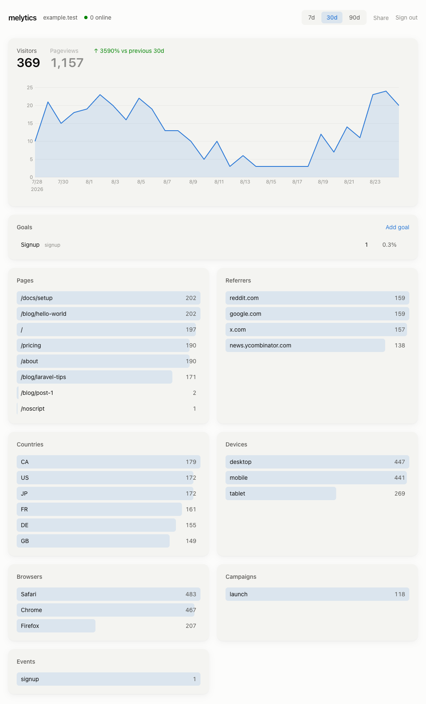

# melytics

Privacy-first, cookieless web analytics. A modern dashboard,
ad-blocker-resistant first-party ingestion, and a two-tier privacy model —
consentless by default, consent-gated extras only where the law requires.



## Features

- Pageviews, uniques, referrers, pages, countries, devices — with cross-filter
  (click any breakdown row to filter everything else)
- Goals & custom events, funnels with drop-off, chart annotations
- Web Vitals (LCP/CLS/INP p75, threshold tracks)
- Retention (new vs returning, tier-2 consented visitors only)
- Public share links (password-optional, stateless HMAC tokens)
- Weekly email digest
- Light/dark theme, drag-to-reorder dashboard modules
- MCP server — query your analytics from Claude or any MCP client

## Layout

| Dir | What |
|---|---|
| `api/` | Laravel API — ingest, enrichment, rollups, stats endpoints |
| `dashboard/` | Vue 3 + Tailwind SPA — mounts anywhere (relative base + hash router) |
| `tracker/` | The snippet. <1KB gzipped, zero deps |
| `mcp/` | MCP server (stdio, 8 tools) over the stats API |
| `deploy/` | Hostinger shared-hosting guide, first-party proxy template, docker-compose for VPS |
| `docs/` | Session handoff log |

## Quick start (local)

```bash
cd api && composer install && cp .env.example .env && php artisan key:generate
php artisan migrate && php artisan melytics:user you@example.com
php artisan serve --port=8901
# separate shell
cd dashboard && npm install && npm run dev   # proxies /api → :8901
```

Build the tracker: `cd tracker && npx esbuild src/m.js --minify --format=iife --outfile=dist/m.js`

## Install on a site

```html
<script defer src="/js/app-m.js" data-site="YOUR_SITE_KEY"></script>
<noscript></noscript>
```

Serve both paths first-party via the proxy rules in
`deploy/htaccess-proxy-template.txt` — that's what makes capture
ad-blocker-resistant.

## Privacy model

- **Tier 1 (always, consentless):** no cookies, no fingerprinting, no PII.
  Uniques via a daily-rotating salted hash; IP used in-memory only.
- **Tier 2 (opt-in, consent-gated):** retention via a persistent localStorage
  visitor id, sent only after `melytics.consent(true)` (hook it to any CMP) and
  stored only for sites with the Privacy toggle enabled. `melytics.consent(false)`
  wipes the id. Ask for consent only where the law requires it — geo-gate the
  prompt client-side (e.g. by IANA timezone).

Custom events: `melytics.track('signup', {plan: 'pro'})`.
