# melytics

<p align="center">
  <a href="https://github.com/fif7y/melytics/stargazers"></a>
  <a href="deploy/shared-hosting.md"></a>
  <a href="mcp/"></a>
  <a href="LICENSE"></a>
  <a href="https://github.com/sponsors/fif7y"></a>
</p>

Privacy-first, cookieless web analytics. A modern dashboard,
ad-blocker-resistant first-party ingestion, and a two-tier privacy model —
consentless by default, consent-gated extras only where the law requires.

<p align="center">
  <a href="https://github.com/fif7y/melytics/releases/latest/download/melytics.zip"></a>
  <br>
  <a href="#install-without-a-terminal-shared-hosting">Install guide ↓</a>
  <br>
  <a href="https://github.com/fif7y/melytics/releases/latest"></a>
  <a href="https://github.com/fif7y/melytics/releases"></a>
</p>

**Runs on the shared hosting you already have. Talks to your AI.**

- **No VPS, no Docker, no ClickHouse.** Every other self-hosted analytics
  assumes a server you administer. melytics runs on plain cPanel-style
  shared hosting: PHP + SQLite + a cron line. If your host can run
  WordPress, it can run melytics — see `deploy/shared-hosting.md`.
- **AI-native.** A bundled MCP server exposes your stats to Claude or any
  MCP client — "what were my top pages last week?", "did the launch spike
  hold?" — answered from your own data, no dashboard tab needed.

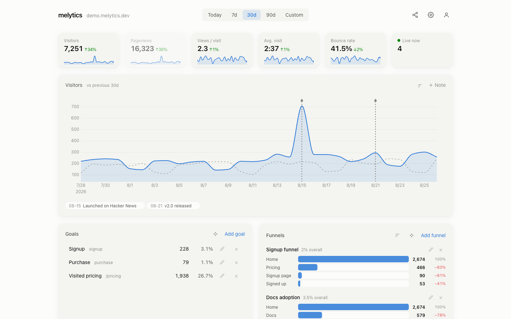

<p align="center">
  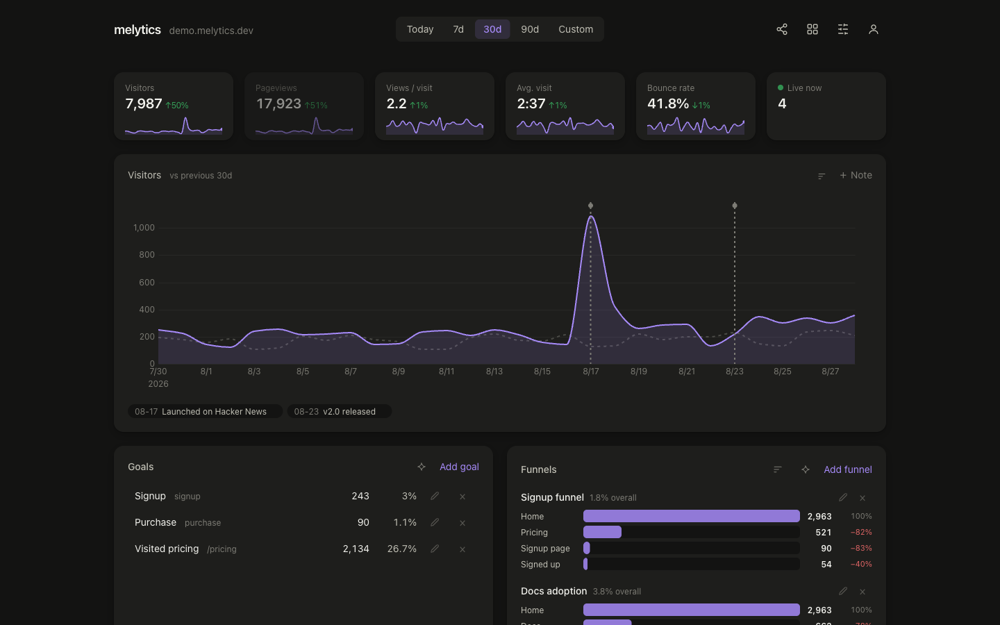
  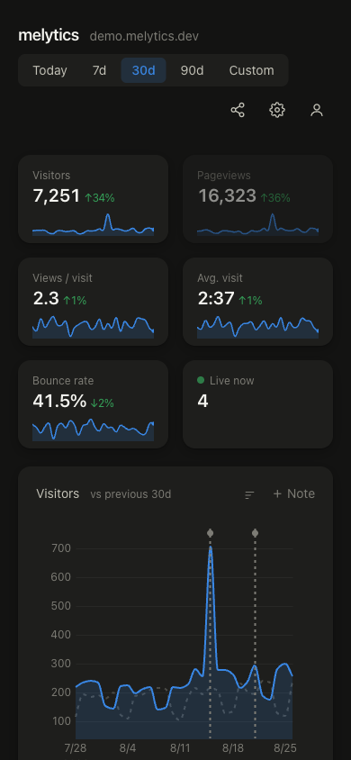
</p>

## Features

**Core analytics**
- Visitors, pageviews, views/visit, visit duration, bounce rate — stat strip
  with sparklines that double as chart metric toggles
- Sessions (30-min gap), entry & exit pages
- Breakdowns: pages, referrers, countries, devices, browsers, OS,
  UTM sources / mediums / campaigns, and channels
  (Direct / Search / Social / AI / Email / Referral)
- **Cross-filter** — click any breakdown row and every stat and panel
  re-filters to that segment
- **Live view** — who's on the site right now, one row per visitor,
  powered by a tracker heartbeat
- Date ranges: presets stay live (rolling), custom ranges with
  this-month / last-month / YTD / last-12-months shortcuts

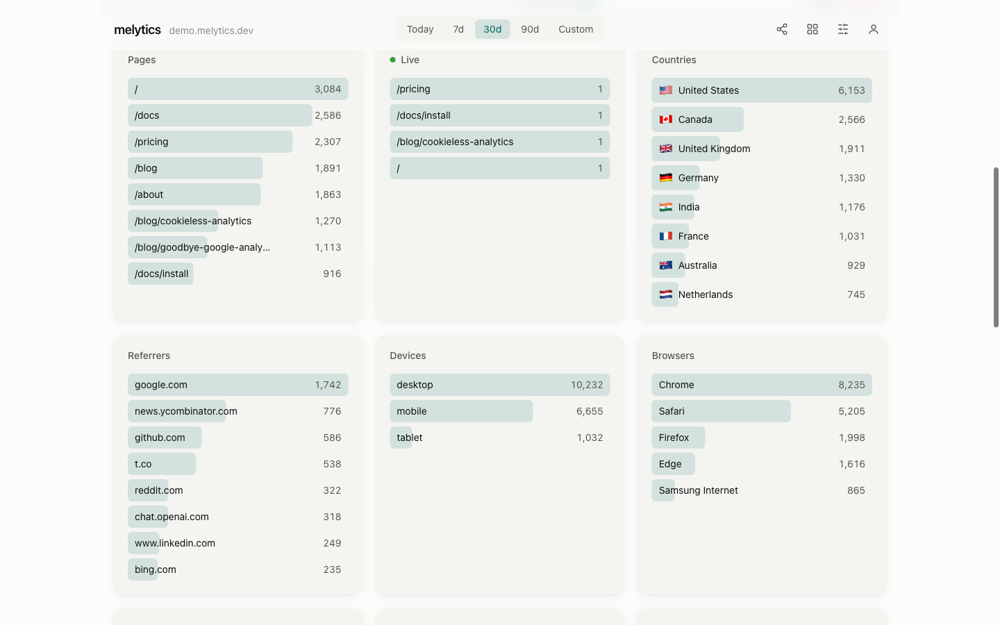

**Goals, funnels & events**
- Goals on custom events or page paths, with conversion rates and inline edit
- Multi-step funnels with per-step drop-off and layout variants
- Custom events: `melytics.track('signup', {plan: 'pro'})`
- Autotracking: outbound links, file downloads, 404s — zero config
- **Setup assistant** — a guided wizard that creates goals and funnels from
  your real tracked pages, no code needed for path-based goals

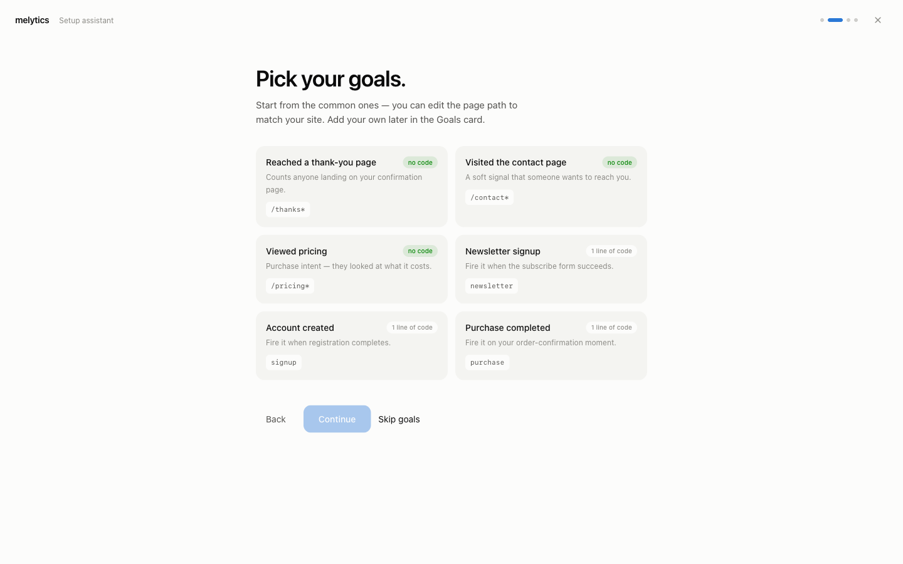

**Cross-filter in action** — one click on the Countries panel:

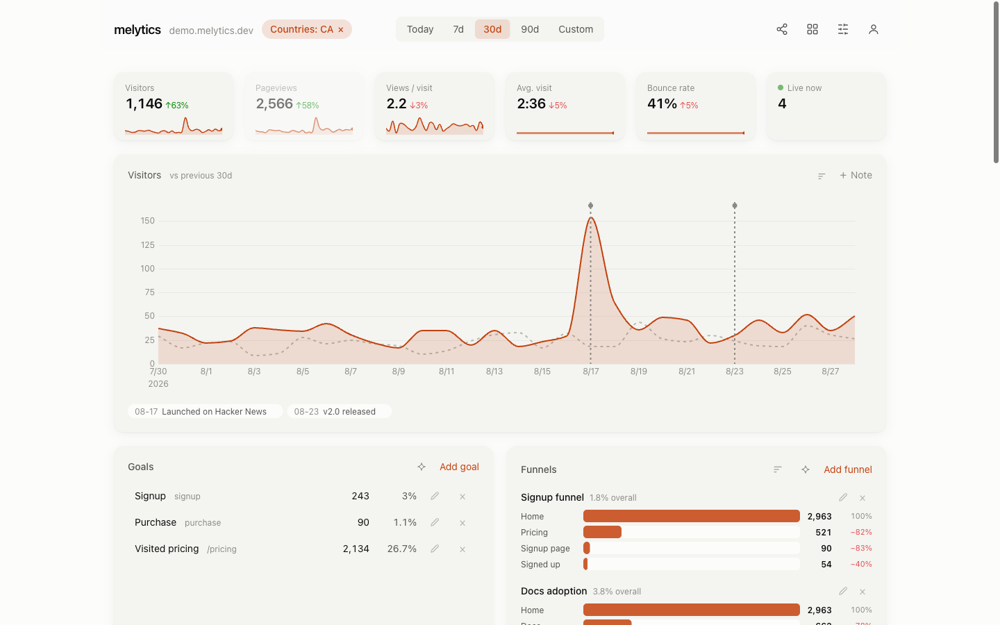

**Performance & alerts**
- Web Vitals p75 (LCP / INP / CLS / TTFB) with good/needs-work/poor
  thresholds, straight from real visitors
- Spike & drop alerts — hourly check against the trailing week's median,
  designed alert email with a mini chart, per-site toggle
- Chart annotations — mark launches and releases right on the graph

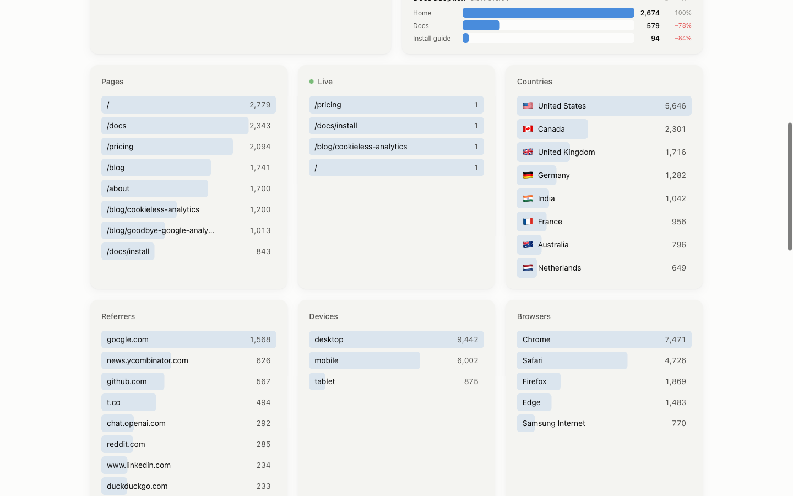

**Audience (tier-2, consent-gated)**
- Retention (new vs returning), weekly cohorts, loyalty buckets
- First-touch attribution and time-to-convert for converting visitors

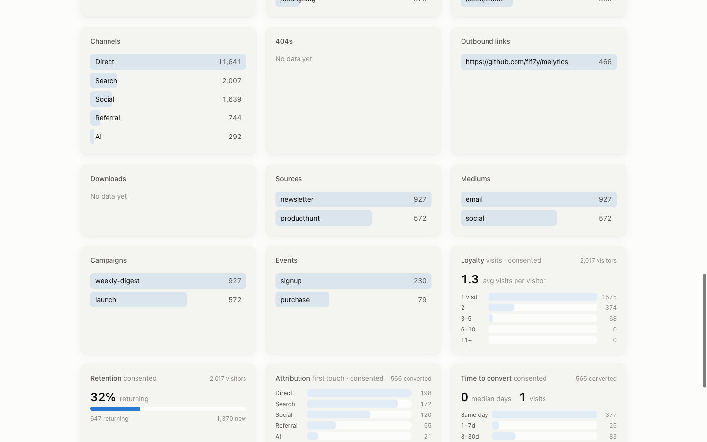

**Layouts — make it yours**

Every visual module has layout variants, one click away and remembered
per browser: the chart and its sparklines share five mark styles
(Smooth / Linear / Step / Bars / Glow), funnels render five ways
(Rows / Strip / Taper / Statline / Bars), and Web Vitals five more
(Tiles / Tracks / Gauges / Bullet / Scoreline). Every variant below also
exists in the other theme — see `docs/screenshots/`.

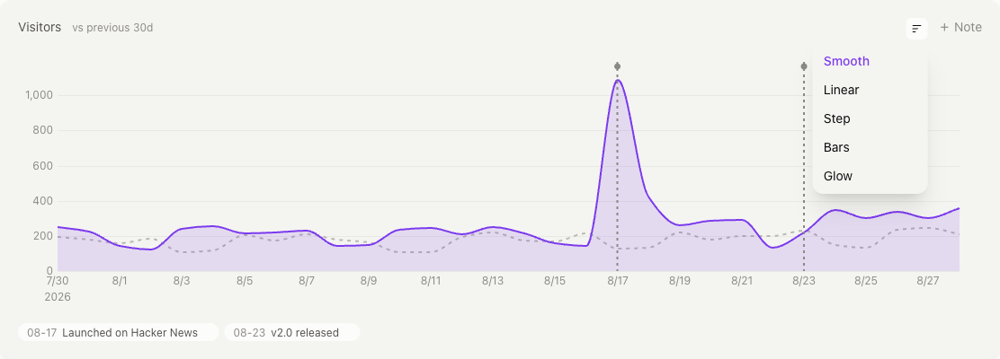

<p align="center">
  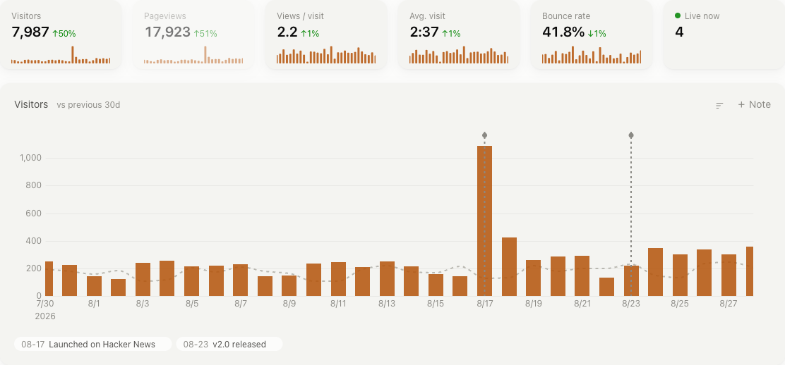
  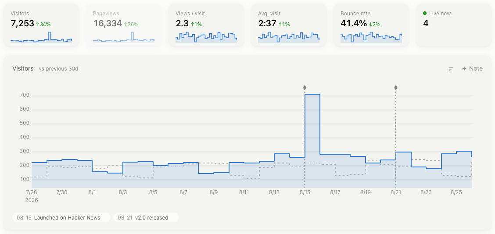
</p>

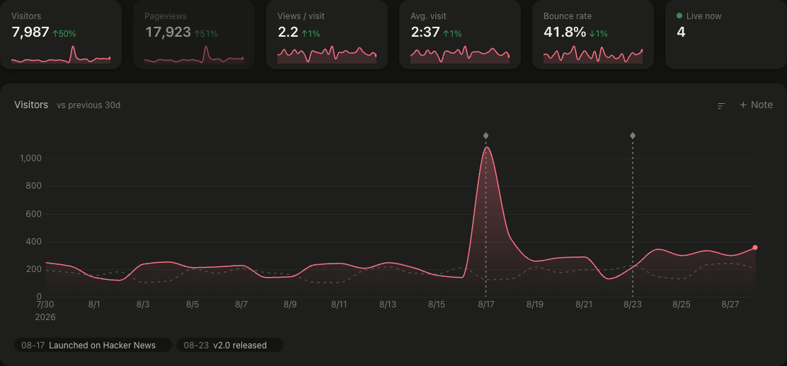

<p align="center">
  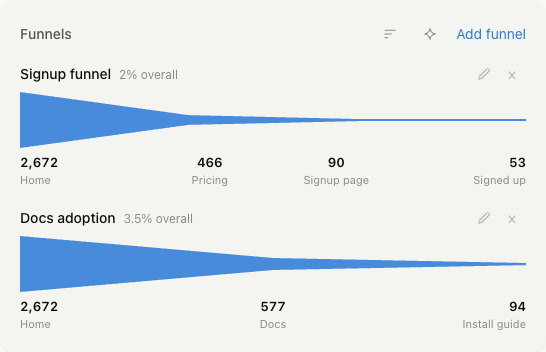
  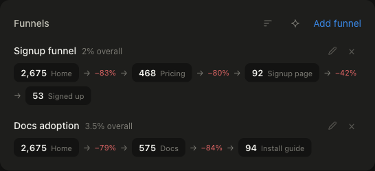
</p>

<p align="center">
  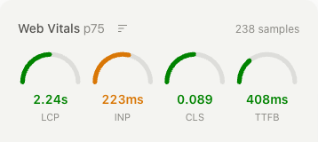
  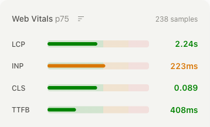
  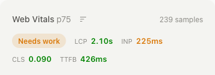
</p>

**Dashboard**
- Light / dark / system theme
- Drag-to-reorder modules, density toggle, per-module visibility —
  hidden modules aren't even fetched
- Public share links (password-optional, stateless HMAC tokens)
- Weekly email digest
- Account panel: theme, notifications, multi-site management with
  copy-paste snippet

<p align="center">
  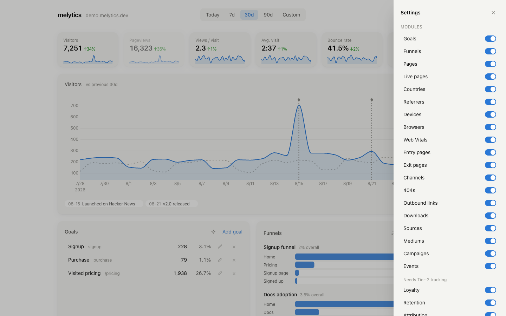
  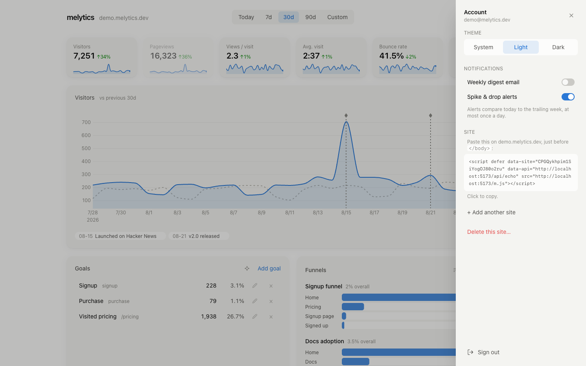
</p>

**Integrations**
- MCP server — query your analytics from Claude or any MCP client (8 tools)
- Plain JSON API behind the dashboard

## Layout

| Dir | What |
|---|---|
| `api/` | Laravel API — ingest, enrichment, rollups, stats endpoints |
| `dashboard/` | Vue 3 + Tailwind SPA — mounts anywhere (relative base + hash router) |
| `tracker/` | The snippet. <1KB gzipped, zero deps |
| `mcp/` | MCP server (stdio, 8 tools) over the stats API |
| `deploy/` | Shared-hosting guide (any cPanel-style host), first-party proxy template, docker-compose for VPS |
| `docs/` | Session handoff log, screenshots |

## Install without a terminal (shared hosting)

Grab the release zip (or build one with `bash deploy/build-release.sh`), then:

1. **Give melytics its own address.** In your hosting panel, create a
   subdomain — `stats.your-domain.com` works nicely — and note which folder
   it serves (usually `public_html/stats`). Everything melytics lives in that
   one folder.
2. **Get the zip's files into that folder.** The files sit at the top of the
   zip (no folder inside a folder), so:
   - If your file manager can extract **into the current folder**: upload the
     zip into the subdomain's folder and extract it there.
   - If it always asks for a **new folder name** (Hostinger and most panel
     file managers do): upload the zip **one level up** (`public_html/`),
     remove the subdomain's folder if the panel already made one, and extract
     using the subdomain folder's exact name (`stats`). The extraction
     creates the folder for you.

   Delete the zip afterwards. Ended up with everything one folder too deep?
   Move that folder's *contents* up one level and delete the empty folder.

   *Prefer to skip the zip entirely?* Upload the one-file
   `melytics-installer.php` into the subdomain's folder and open it in your
   browser — it downloads and unpacks the release by itself.
3. **Open `https://stats.your-domain.com/` in your browser.** The installer
   checks your server, creates your login and first site, then walks you
   through the last three steps on screen: paste the tracking snippet into
   your site (purge your site's cache after — caching plugins keep serving
   the old pages), add the every-minute cron job (it hands you the exact
   command — choose "Custom" if your panel asks, and set every schedule
   field to "Every…"), and sign in. No cron yet? Stats still refresh whenever
   you open the dashboard, and it reminds you with the exact line until the
   job runs.

Everything runs on SQLite — no database to create. Details and troubleshooting
in [`deploy/shared-hosting.md`](deploy/shared-hosting.md).

**Updates are one click too.** When a new release is out, the dashboard shows a
banner (and Account shows the version) — the admin hits *Update now* and the
instance downloads the release, swaps itself in place, and migrates. Your
config, data, and `.htaccess` are never touched. Git checkouts update with
`git pull` instead.

## Quick start (local)

```bash
cd api && composer install && cp .env.example .env && php artisan key:generate
php artisan migrate && php artisan melytics:user you@example.com
php artisan serve --port=8901
# separate shell
cd dashboard && npm install && npm run dev   # proxies /api → :8901
```

Want the dashboard full of realistic data (like the screenshots above)?

```bash
cd api && php artisan db:seed --class=DemoSeeder && php artisan melytics:rollup --hours=2208
# log in as demo@melytics.dev / demopass1234
```

Build the tracker: `cd tracker && npx esbuild src/m.js --minify --format=iife --outfile=dist/m.js`

## Install on a site

```html
<script defer src="/js/app-m.js" data-site="YOUR_SITE_KEY"></script>
<noscript></noscript>
```

Serve both paths first-party via the proxy rules in
`deploy/htaccess-proxy-template.txt` — that's what makes capture
ad-blocker-resistant.

## Privacy model

- **Tier 1 (always, consentless):** no cookies, no fingerprinting, no PII.
  Uniques via a daily-rotating salted hash; IP used in-memory only.
- **Tier 2 (opt-in, consent-gated):** retention, cohorts, loyalty and
  attribution via a persistent localStorage visitor id, sent only after
  `melytics.consent(true)` (hook it to any CMP) and stored only for sites
  with the Privacy toggle enabled. `melytics.consent(false)` wipes the id.
  Ask for consent only where the law requires it — geo-gate the prompt
  client-side (e.g. by IANA timezone).

## License

[AGPL-3.0](LICENSE). Self-host freely; if you offer melytics as a hosted
service with modifications, you must share those changes under the same
license.
